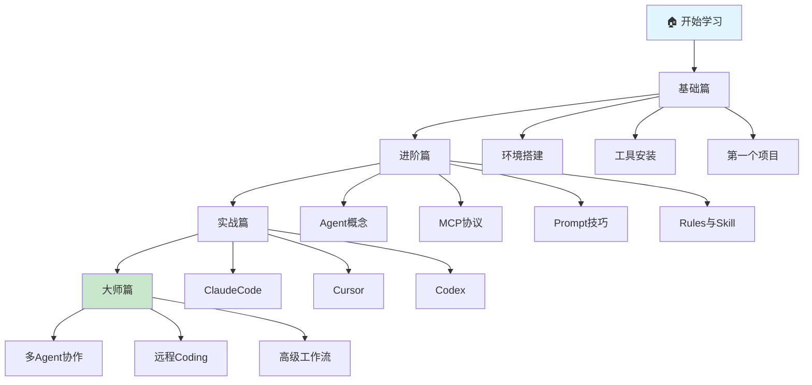

# AI Coding Guide Book 📚

> 从零开始的 AI 编程指南，专为初级开发者打造

## 🎯 项目定位

这是一份**面向初级 iOS 开发者**的 AI 编程入门教程。从环境搭建到高级多 Agent 协作，带你系统掌握 AI 辅助编程的核心技能。

## 📖 内容结构

### 基础篇 - 打好地基
- **01-环境搭建**：nvm、Node.js、Homebrew 安装配置
- **02-工具安装**：Claude Code、Cursor、Codex CLI 安装
- **03-第一个项目**：用 AI 完成你的第一个实战项目

### 进阶篇 - 核心概念
- **01-Agent 概念**：什么是 AI Agent，如何与 Agent 协作
- **02-MCP 协议**：Model Context Protocol 深度解析
- **03-Prompt 技巧**：编写高质量 Prompt 的方法论
- **04-Rules 与 Skill**：AGENTS.md 配置与技能扩展

### 实战篇 - 真刀真枪
- **01-Claude Code 实战**：终端里的 AI 结对编程
- **02-Cursor 实战**：最强 AI IDE 使用指南
- **03-Codex 实战**：OpenAI 的命令行编程助手

### 大师篇 - 登峰造极
- **01-多 Agent 协作**：编排多个 AI Agent 并行工作
- **02-OpenClaw 远程 Coding**：随时随地调用 AI 编程
- **03-高级工作流**：CI/CD 集成、代码审查自动化

## 🚀 快速开始

### 适合谁读？
- ✅ 有基础的 iOS 开发者（了解 Swift、Xcode）
- ✅ 想提升开发效率的独立开发者
- ✅ 对 AI 编程感兴趣的技术爱好者

### 你将学到
- 🔧 搭建完整的 AI 编程环境
- 💬 掌握与 AI 高效沟通的技巧
- 🤖 理解 Agent、MCP、Prompt 等核心概念
- 🚀 构建自己的 AI 编程工作流

## 📚 推荐学习路径

**预计学习时间**：
- 基础篇：1-2 周（边学边练）
- 进阶篇：2-3 周（深入理解）
- 实战篇：持续实践（技能提升）
- 大师篇：按需学习（进阶探索）

## 🛠 技术栈

| 工具 | 用途 | 推荐指数 |
|------|------|----------|
| Claude Code | 终端 AI 编程助手 | ⭐⭐⭐⭐⭐ |
| Cursor | AI 增强编辑器 | ⭐⭐⭐⭐⭐ |
| Codex CLI | OpenAI 命令行工具 | ⭐⭐⭐⭐ |
| OpenClaw | 远程 AI Agent 网关 | ⭐⭐⭐⭐ |

## 📖 章节导航

### 基础篇 - 打好地基
- [环境搭建](./docs/基础篇/01-环境搭建/README.md) - Homebrew、nvm、Node.js 配置
- [工具安装](./docs/基础篇/02-工具安装/) - Claude Code、Cursor、Codex 安装
- [第一个项目](./docs/基础篇/03-第一个项目/) - 用 AI 完成实战项目

### 进阶篇 - 核心概念
- [Agent 概念](./docs/进阶篇/01-Agent概念/README.md) - AI Agent 的组成与协作
- [MCP 协议](./docs/进阶篇/02-MCP协议/README.md) - Model Context Protocol 详解
- [Prompt 技巧](./docs/进阶篇/03-Prompt技巧/) - 高质量 Prompt 方法论
- [Rules 与 Skill](./docs/进阶篇/04-Rules与Skill/) - AGENTS.md 配置

### 实战篇 - 真刀真枪
- [Claude Code 实战](./docs/实战篇/01-ClaudeCode实战/README.md) - 终端 AI 编程
- [Cursor 实战](./docs/实战篇/02-Cursor实战/) - AI IDE 使用指南
- [Codex 实战](./docs/实战篇/03-Codex实战/) - OpenAI 命令行工具

### 大师篇 - 登峰造极
- [多 Agent 协作](./docs/大师篇/01-多Agent协作/README.md) - 并行工作编排
- [OpenClaw 远程 Coding](./docs/大师篇/02-OpenClaw远程Coding/README.md) - 随时随地编程
- [高级工作流](./docs/大师篇/03-高级工作流/) - CI/CD 集成

## 📝 贡献指南

欢迎提交 Issue 和 Pull Request！

- 发现错误 → 提 Issue
- 有好案例 → 提 PR
- 有建议 → 讨论区交流
- 想要新章节 → 提 Feature Request

## 📜 许可证

MIT License - 自由使用，请保留原作者信息

---

## 🙏 致谢

感谢以下项目和资源的启发：

- [OpenClaw](https://docs.openclaw.ai/) - 开源 AI Agent 网关
- [Model Context Protocol](https://modelcontextprotocol.io/) - MCP 协议官方文档
- [OpenAI Codex](https://developers.openai.com/codex/cli) - Codex CLI 文档
- [AGENTS.md Best Practices](https://agentsmd.io/) - AI 配置文件最佳实践

---

**开始学习** → [基础篇：环境搭建](./docs/基础篇/01-环境搭建/README.md)

**Star ⭐ 本项目，随时查阅最新内容！**
