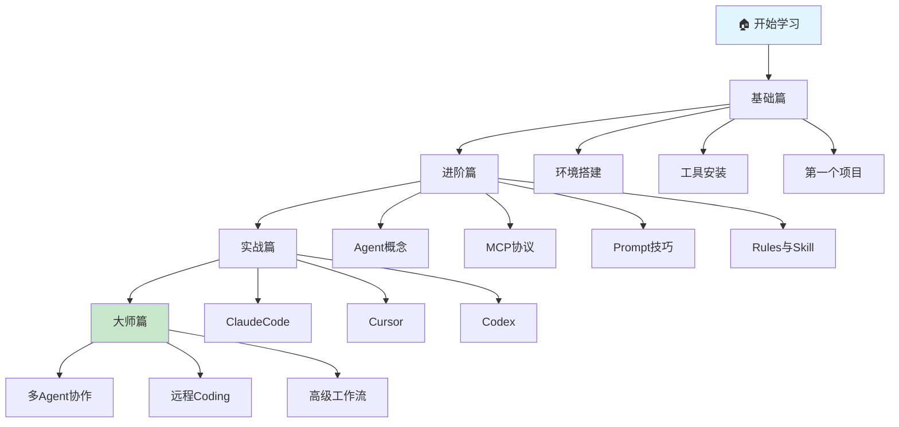

# AI Coding Guide Book 📚

> 从零开始的 AI 编程指南，专为初级开发者打造

## 🎯 项目定位

这是一份**面向初级 iOS 开发者**的 AI 编程入门教程。从环境搭建到高级多 Agent 协作，带你系统掌握 AI 辅助编程的核心技能。

## 📖 内容导航

```
aicoding-guide-book/
│
├─ 📘 基础篇（13章）─────── 打好地基
│  ├─ 🛠 环境搭建（7章）
│  │  ├─ Homebrew ───────── 包管理器
│  │  ├─ nvm ────────────── Node版本管理
│  │  ├─ Node.js ────────── 运行环境
│  │  ├─ Git ────────────── 版本控制
│  │  ├─ 环境验证 ───────── 一键验证
│  │  ├─ 终端工具 ───────── iTerm2/Ghostty/tmux/Tabby
│  │  └─ AI模型全景 ─────── 海外+国内主流模型
│  ├─ 🔧 工具安装（5章）
│  │  ├─ Claude Code ────── 终端AI助手
│  │  ├─ Cursor ─────────── AI编辑器
│  │  ├─ Codex ──────────── GPT-5工具
│  │  └─ 工具对比 ───────── 选择指南
│  └─ 🎯 第一个项目（1章）
│     └─ TodoApp实战 ────── 完整流程
│
├─ 📗 进阶篇（4章）─────── 核心概念
│  ├─ Agent概念 ─────────── AI代理
│  ├─ MCP协议 ───────────── 工具连接
│  ├─ Prompt技巧 ────────── 高效沟通
│  └─ Rules与Skill ──────── 项目配置
│
├─ 📙 实战篇（3章）─────── 真刀真枪
│  ├─ ClaudeCode实战 ────── 终端编程
│  ├─ Cursor实战 ────────── IDE使用
│  └─ Codex实战 ─────────── 命令行
│
├─ 📕 大师篇（3章）─────── 登峰造极
│  ├─ 多Agent协作 ───────── 并行开发
│  ├─ 远程Coding ────────── 随时随地
│  └─ 高级工作流 ────────── CI/CD
│
├─ 📚 实用资源（7个）
│  ├─ 故障排查 ──────────── 50+问题
│  ├─ 快速参考 ──────────── 速查卡片
│  ├─ 最佳实践 ──────────── 5个案例
│  ├─ 术语表 ────────────── 中英对照
│  ├─ 学习路径 ──────────── 4周计划
│  ├─ 示例代码 ──────────── 开箱即用
│  └─ 资源汇总 ──────────── 官方文档
│
└─ 📄 项目信息（3个）
   ├─ CHANGELOG ──────────── 版本历史
   ├─ CONTRIBUTING ───────── 贡献指南
   └─ LICENSE ────────────── MIT许可
```

## 🚀 快速开始

### 适合谁读？
- ✅ 有基础的 iOS 开发者（了解 Swift、Xcode）
- ✅ 想提升开发效率的独立开发者
- ✅ 对 AI 编程感兴趣的技术爱好者

### 你将学到
- 🔧 搭建完整的 AI 编程环境
- 💬 掌握与 AI 高效沟通的技巧
- 🤖 理解 Agent、MCP、Prompt 等核心概念
- 🚀 构建自己的 AI 编程工作流

## 📚 推荐学习路径



**预计学习时间**：
- 基础篇：1-2 周（边学边练）
- 进阶篇：2-3 周（深入理解）
- 实战篇：持续实践（技能提升）
- 大师篇：按需学习（进阶探索）

## 📊 项目统计

- **文档总数**：36 个 Markdown 文件
- **总行数**：12,000+ 行
- **Git 提交**：14 次增量提交
- **Git 历史**：完整可追溯
- **开源许可**：MIT License

## 📋 完成度

| 工具 | 用途 | 推荐指数 |
|------|------|----------|
| Claude Code | 终端 AI 编程助手 | ⭐⭐⭐⭐⭐ |
| Cursor | AI 增强编辑器 | ⭐⭐⭐⭐⭐ |
| Codex CLI | OpenAI 命令行工具 | ⭐⭐⭐⭐ |
| OpenClaw | 远程 AI Agent 网关 | ⭐⭐⭐⭐ |

## 🎓 学习建议

**新手路径**：
1. 先完成环境搭建（基础篇第一章）
2. 快速体验 AI 编程（5分钟快速开始）
3. 选择一个工具深入学习（实战篇）
4. 理解核心概念（进阶篇）

**进阶路径**：
1. 深入理解 Agent 和 MCP
2. 掌握 Prompt 工程技巧
3. 配置项目级 AGENTS.md
4. 尝试多 Agent 协作

**大师路径**：
1. 构建完整的 CI/CD 工作流
2. 实现远程 AI 编程
3. 探索 AI 驱动的自动化
4. 分享你的实践经验

## 📖 章节导航

### 基础篇 - 打好地基
- [环境搭建](./docs/基础篇/01-环境搭建/README.md) - Homebrew、nvm、Node.js 配置
- [工具安装](./docs/基础篇/02-工具安装/) - Claude Code、Cursor、Codex 安装
- [第一个项目](./docs/基础篇/03-第一个项目/) - 用 AI 完成实战项目

### 进阶篇 - 核心概念
- [Agent 概念](./docs/进阶篇/01-Agent概念/README.md) - AI Agent 的组成与协作
- [MCP 协议](./docs/进阶篇/02-MCP协议/README.md) - Model Context Protocol 详解
- [Prompt 技巧](./docs/进阶篇/03-Prompt技巧/) - 高质量 Prompt 方法论
- [Rules 与 Skill](./docs/进阶篇/04-Rules与Skill/) - AGENTS.md 配置

### 实战篇 - 真刀真枪
- [Claude Code 实战](./docs/实战篇/01-ClaudeCode实战/README.md) - 终端 AI 编程
- [Cursor 实战](./docs/实战篇/02-Cursor实战/) - AI IDE 使用指南
- [Codex 实战](./docs/实战篇/03-Codex实战/) - OpenAI 命令行工具

### 大师篇 - 登峰造极
- [多 Agent 协作](./docs/大师篇/01-多Agent协作/README.md) - 并行工作编排
- [OpenClaw 远程 Coding](./docs/大师篇/02-OpenClaw远程Coding/README.md) - 随时随地编程
- [高级工作流](./docs/大师篇/03-高级工作流/) - CI/CD 集成

## 📝 贡献指南

欢迎提交 Issue 和 Pull Request！

- 发现错误 → 提 Issue
- 有好案例 → 提 PR
- 有建议 → 讨论区交流
- 想要新章节 → 提 Feature Request

## 📋 完成度

| 篇章 | 状态 | 文档数 | 说明 |
|------|------|--------|------|
| 基础篇 | ✅ 100% | 11 | 环境搭建、工具安装、第一个项目 |
| 进阶篇 | ✅ 100% | 4 | Agent、MCP、Prompt、Rules |
| 实战篇 | ✅ 100% | 3 | ClaudeCode、Cursor、Codex |
| 大师篇 | ✅ 100% | 3 | 多Agent、远程Coding、高级工作流 |
| 实用文档 | ✅ 100% | 7 | FAQ、快速参考、最佳实践、术语表、学习路径、资源汇总 |
| 示例代码 | ✅ 100% | 2 | AGENTS模板、Swift代码模板 |
| 项目文档 | ✅ 100% | 3 | CHANGELOG、CONTRIBUTING、LICENSE |

**总计**：24 个 Markdown 文件

---

## 🚀 快速导航

**新手入门**：
1. [环境搭建](./docs/基础篇/01-环境搭建/README.md) - 安装必备工具
2. [工具安装](./docs/基础篇/02-工具安装/README.md) - 安装 AI 编程工具
3. [第一个项目](./docs/基础篇/03-第一个项目/README.md) - 实战练习

**深入学习**：
1. [Agent 概念](./docs/进阶篇/01-Agent概念/README.md) - 理解 AI Agent
2. [MCP 协议](./docs/进阶篇/02-MCP协议/README.md) - 连接外部世界
3. [Prompt 技巧](./docs/进阶篇/03-Prompt技巧/README.md) - 高效沟通

**实战提升**：
1. [Claude Code](./docs/实战篇/01-ClaudeCode实战/README.md) - 终端 AI 编程
2. [Cursor](./docs/实战篇/02-Cursor实战/README.md) - AI IDE 使用
3. [Codex](./docs/实战篇/03-Codex实战/README.md) - GPT-5 驱动

**大师之路**：
1. [多 Agent 协作](./docs/大师篇/01-多Agent协作/README.md) - 团队协作
2. [远程 Coding](./docs/大师篇/02-OpenClaw远程Coding/README.md) - 随时随地
3. [高级工作流](./docs/大师篇/03-高级工作流/README.md) - 自动化实践

**实用资源**：
1. [AGENTS 模板](./examples/AGENTS-examples.md) - 配置模板
2. [Swift 模板](./examples/swift-templates.md) - 代码模板
3. [故障排查](./docs/FAQ.md) - 常见问题解决
4. [快速参考](./docs/cheat-sheet.md) - 速查卡片
5. [最佳实践](./docs/best-practices.md) - 实战案例
6. [术语表](./docs/glossary.md) - 术语速查
7. [学习路径](./docs/learning-path.md) - 4周学习计划
8. [资源汇总](./resources/README.md) - 官方文档

**项目信息**：
- [变更日志](./CHANGELOG.md) - 版本历史
- [贡献指南](./CONTRIBUTING.md) - 如何贡献
- [开源许可](./LICENSE) - MIT License

## 📜 许可证

MIT License - 自由使用，请保留原作者信息

---

## 🙏 致谢

感谢以下项目和资源的启发：

- [OpenClaw](https://docs.openclaw.ai/) - 开源 AI Agent 网关
- [Model Context Protocol](https://modelcontextprotocol.io/) - MCP 协议官方文档
- [OpenAI Codex](https://developers.openai.com/codex/cli) - Codex CLI 文档
- [AGENTS.md Best Practices](https://agentsmd.io/) - AI 配置文件最佳实践

---

**开始学习** → [基础篇：环境搭建](./docs/基础篇/01-环境搭建/README.md)

**Star ⭐ 本项目，随时查阅最新内容！**
