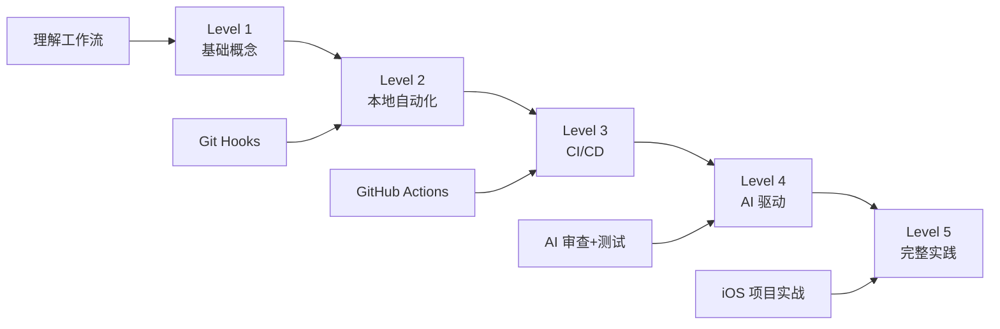

# 03-高级工作流

> 从手动到自动，从人工到 AI 驱动

## 🎯 本章目标

完成本章后，你将掌握：
- ✅ 工作流的基本概念和价值
- ✅ 本地自动化（Git Hooks）
- ✅ CI/CD 基础（GitHub Actions）
- ✅ AI 驱动的工作流
- ✅ iOS 项目完整工作流实践

## 📚 知识递进路径



---

## Level 1: 基础概念

### 什么是工作流

**工作流（Workflow）** 是一系列自动化步骤，用于完成特定目标。

### 传统开发流程

```
1. 编写代码
2. 手动运行测试
3. 手动代码审查
4. 手动构建
5. 手动部署
6. 手动通知团队

问题：
- 容易遗漏步骤
- 重复性工作多
- 人为错误多
- 效率低下
```

### 自动化工作流

```
1. 编写代码
2. 提交代码
3. 自动触发：
   ├─ 自动运行测试
   ├─ 自动代码审查
   ├─ 自动构建
   ├─ 自动部署
   └─ 自动通知团队

优势：
- 不会遗漏步骤
- 效率提升 10x
- 质量有保障
- 团队协作顺畅
```

### 工作流的价值

| 维度 | 手动 | 自动化 | 提升 |
|------|------|--------|------|
| 时间 | 30分钟/次 | 3分钟/次 | 10x |
| 错误率 | 10% | 0.1% | 100x |
| 可重复性 | 低 | 高 | - |
| 团队一致性 | 低 | 高 | - |

---

## Level 2: 本地自动化

### Git Hooks 基础

**Git Hooks** 是 Git 提供的钩子机制，在特定事件触发时执行脚本。

### 常用 Hooks

| Hook | 触发时机 | 用途 |
|------|----------|------|
| pre-commit | 提交前 | 代码检查、格式化 |
| pre-push | 推送前 | 运行测试 |
| commit-msg | 提交消息编辑后 | 验证提交消息格式 |
| post-merge | 合并后 | 自动安装依赖 |

### 实战：pre-commit 钩子

#### 创建钩子

```bash
# 进入项目目录
cd ~/Projects/my-app

# 创建 pre-commit 钩子
cat > .git/hooks/pre-commit << 'EOF'
#!/bin/bash

echo "🔍 运行 pre-commit 检查..."

# 1. SwiftLint 检查
if command -v swiftlint &> /dev/null; then
    echo "运行 SwiftLint..."
    swiftlint
    if [ $? -ne 0 ]; then
        echo "❌ SwiftLint 检查失败"
        exit 1
    fi
fi

# 2. 运行测试
echo "运行单元测试..."
xcodebuild test -scheme MyProject -destination 'platform=iOS Simulator,name=iPhone 15' | xcpretty
if [ $? -ne 0 ]; then
    echo "❌ 测试失败"
    exit 1
fi

echo "✅ 所有检查通过"
exit 0
EOF

# 添加执行权限
chmod +x .git/hooks/pre-commit
```

#### 效果

```
git commit -m "feat: 添加新功能"

🔍 运行 pre-commit 检查...
运行 SwiftLint...
✅ SwiftLint 检查通过
运行单元测试...
✅ 所有测试通过
[main abc123] feat: 添加新功能
```

### 使用 Husky（推荐）

Husky 是一个 Git Hooks 管理工具，让配置更简单。

```bash
# 安装 Husky
npm install -D husky

# 初始化 Husky
npx husky init

# 添加 pre-commit 钩子
echo 'npm test' > .husky/pre-commit

# 添加 commit-msg 钩子
echo 'npx commitlint --edit $1' > .husky/commit-msg
```

### commitlint - 提交消息规范

```bash
# 安装 commitlint
npm install -D @commitlint/cli @commitlint/config-conventional

# 创建配置文件
echo "export default { extends: ['@commitlint/config-conventional'] };" > commitlint.config.js
```

**规范的提交格式：**

```
type(scope): subject

类型（type）：
- feat: 新功能
- fix: 修复 Bug
- docs: 文档更新
- style: 代码格式
- refactor: 重构
- test: 测试
- chore: 构建/工具

示例：
feat(user): 添加用户登录功能
fix(cart): 修复购物车数量计算错误
docs(readme): 更新安装说明
```

---

## Level 3: CI/CD 入门

### 什么是 CI/CD

```
CI (Continuous Integration) - 持续集成
├─ 自动运行测试
├─ 自动代码检查
└─ 自动构建

CD (Continuous Delivery/Deployment) - 持续交付/部署
├─ 自动打包
├─ 自动发布
└─ 自动部署
```

### GitHub Actions 基础

GitHub Actions 是 GitHub 提供的 CI/CD 服务。

#### 基本概念

```
Workflow（工作流）
├─ 一个自动化流程
└─ 定义在 .github/workflows/*.yml

Job（任务）
├─ 工作流中的一组步骤
└─ 可以并行或串行执行

Step（步骤）
├─ 任务中的一个操作
└─ 执行命令或使用 Action

Action（动作）
├─ 可复用的操作单元
└─ 官方或社区提供
```

#### 第一个 Workflow

创建 `.github/workflows/test.yml`：

```yaml
name: Run Tests

on:
  push:
    branches: [ main ]
  pull_request:
    branches: [ main ]

jobs:
  test:
    runs-on: macos-latest
    
    steps:
    - name: Checkout code
      uses: actions/checkout@v4
    
    - name: Set up Xcode
      uses: maxim-lobanov/setup-xcode@v1
      with:
        xcode-version: latest-stable
    
    - name: Run tests
      run: |
        xcodebuild test \
          -scheme MyProject \
          -destination 'platform=iOS Simulator,name=iPhone 15,OS=latest' \
          | xcpretty
    
    - name: Upload test results
      if: always()
      uses: actions/upload-artifact@v4
      with:
        name: test-results
        path: test-results/
```

#### 触发条件

```yaml
on:
  # 推送时触发
  push:
    branches: [ main, develop ]
  
  # PR 时触发
  pull_request:
    branches: [ main ]
  
  # 定时触发
  schedule:
    - cron: '0 0 * * *'  # 每天 0 点
  
  # 手动触发
  workflow_dispatch:
```

### iOS 项目完整 CI

```yaml
name: iOS CI

on:
  push:
    branches: [ main ]
  pull_request:
    branches: [ main ]

env:
  SCHEME: MyProject
  DESTINATION: 'platform=iOS Simulator,name=iPhone 15 Pro,OS=latest'

jobs:
  # 任务 1: 代码检查
  lint:
    runs-on: macos-latest
    steps:
    - uses: actions/checkout@v4
    
    - name: Install SwiftLint
      run: brew install swiftlint
    
    - name: Run SwiftLint
      run: swiftlint --strict

  # 任务 2: 单元测试
  test:
    runs-on: macos-latest
    needs: lint  # 依赖 lint 任务
    
    steps:
    - uses: actions/checkout@v4
    
    - name: Set up Xcode
      uses: maxim-lobanov/setup-xcode@v1
      with:
        xcode-version: latest-stable
    
    - name: Run unit tests
      run: |
        xcodebuild test \
          -scheme $SCHEME \
          -destination "$DESTINATION" \
          -enableCodeCoverage YES \
          | xcpretty
    
    - name: Upload coverage
      uses: codecov/codecov-action@v3
      with:
        files: ./coverage.xml

  # 任务 3: 构建
  build:
    runs-on: macos-latest
    needs: test  # 依赖 test 任务
    
    steps:
    - uses: actions/checkout@v4
    
    - name: Set up Xcode
      uses: maxim-lobanov/setup-xcode@v1
      with:
        xcode-version: latest-stable
    
    - name: Build
      run: |
        xcodebuild build \
          -scheme $SCHEME \
          -destination "$DESTINATION" \
          -configuration Release \
          | xcpretty
    
    - name: Archive
      run: |
        xcodebuild archive \
          -scheme $SCHEME \
          -archivePath build/MyProject.xcarchive \
          | xcpretty
    
    - name: Upload artifact
      uses: actions/upload-artifact@v4
      with:
        name: MyProject.app
        path: build/MyProject.xcarchive
```

---

## Level 4: AI 驱动的工作流

### AI 代码审查

#### 使用 Codex 自动审查

```yaml
name: AI Code Review

on:
  pull_request:
    types: [opened, synchronize]

jobs:
  review:
    runs-on: ubuntu-latest
    steps:
    - uses: actions/checkout@v4
      with:
        fetch-depth: 0
    
    - name: Set up Node.js
      uses: actions/setup-node@v4
      with:
        node-version: '20'
    
    - name: Install Codex
      run: npm install -g @openai/codex
    
    - name: Run AI Review
      env:
        OPENAI_API_KEY: ${{ secrets.OPENAI_API_KEY }}
      run: |
        codex --non-interactive \
          --task "审查 PR 的代码质量，检查：
          1. 是否符合 Swift 最佳实践
          2. 是否有潜在的性能问题
          3. 是否有安全隐患
          4. 是否有未处理的错误
          输出格式：Markdown 报告" \
          --output review.md
    
    - name: Post Review Comment
      uses: actions/github-script@v7
      with:
        script: |
          const fs = require('fs');
          const review = fs.readFileSync('review.md', 'utf8');
          github.rest.issues.createComment({
            owner: context.repo.owner,
            repo: context.repo.repo,
            issue_number: context.issue.number,
            body: `## 🤖 AI 代码审查报告\n\n${review}`
          });
```

#### 使用 Claude Code 自动审查

```yaml
name: Claude Code Review

on:
  pull_request:
    types: [opened, synchronize]

jobs:
  review:
    runs-on: ubuntu-latest
    steps:
    - uses: actions/checkout@v4
    
    - name: Setup Claude Code
      uses: anthropics/setup-claude-code@v1
      with:
        api-key: ${{ secrets.ANTHROPIC_API_KEY }}
    
    - name: Run Review
      run: |
        claude --non-interactive \
          --prompt "审查这个 PR 的代码：
          1. 代码质量
          2. 架构设计
          3. 测试覆盖
          4. 文档完整性
          请给出改进建议" \
          --output claude-review.md
    
    - name: Comment PR
      uses: actions/github-script@v7
      with:
        script: |
          const fs = require('fs');
          const review = fs.readFileSync('claude-review.md', 'utf8');
          github.rest.issues.createComment({
            owner: context.repo.owner,
            repo: context.repo.repo,
            issue_number: context.issue.number,
            body: `## 🤖 Claude 代码审查\n\n${review}`
          });
```

### AI 自动化测试

#### 自动生成测试

```yaml
name: AI Test Generation

on:
  push:
    paths:
      - 'Sources/**/*.swift'

jobs:
  generate-tests:
    runs-on: macos-latest
    steps:
    - uses: actions/checkout@v4
    
    - name: Setup AI Tools
      run: npm install -g @anthropic-ai/claude-code
    
    - name: Generate Tests
      env:
        ANTHROPIC_API_KEY: ${{ secrets.ANTHROPIC_API_KEY }}
      run: |
        # 找到修改的文件
        CHANGED_FILES=$(git diff --name-only HEAD~1 HEAD | grep '\.swift$')
        
        for FILE in $CHANGED_FILES; do
          echo "为 $FILE 生成测试..."
          claude --non-interactive \
            --prompt "为 $FILE 生成单元测试，要求：
            1. 覆盖所有 public 方法
            2. 包含边界条件测试
            3. 包含错误处理测试
            输出到 Tests/${FILE}" \
            --approve-all
        done
    
    - name: Run Generated Tests
      run: |
        xcodebuild test \
          -scheme MyProject \
          -destination 'platform=iOS Simulator,name=iPhone 15' \
          | xcpretty
    
    - name: Commit Tests
      run: |
        git config user.name "AI Test Bot"
        git config user.email "bot@example.com"
        git add Tests/
        git commit -m "test: AI 自动生成测试用例"
        git push
```

### AI 辅助部署

#### 自动发布到 TestFlight

```yaml
name: Deploy to TestFlight

on:
  push:
    tags:
      - 'v*'

jobs:
  deploy:
    runs-on: macos-latest
    steps:
    - uses: actions/checkout@v4
    
    - name: Set up Xcode
      uses: maxim-lobanov/setup-xcode@v1
      with:
        xcode-version: latest-stable
    
    - name: Install dependencies
      run: |
        bundle install
        pod install
    
    - name: Build and Archive
      run: |
        xcodebuild \
          -workspace MyProject.xcworkspace \
          -scheme MyProject \
          -archivePath build/MyProject.xcarchive \
          archive \
          | xcpretty
    
    - name: Export IPA
      run: |
        xcodebuild \
          -exportArchive \
          -archivePath build/MyProject.xcarchive \
          -exportOptionsPlist ExportOptions.plist \
          -exportPath build/ \
          | xcpretty
    
    - name: Upload to TestFlight
      env:
        APP_STORE_CONNECT_API_KEY: ${{ secrets.APP_STORE_CONNECT_API_KEY }}
      run: |
        xcrun altool \
          --upload-app \
          --type ios \
          --file build/MyProject.ipa \
          --apiKey $APP_STORE_CONNECT_API_KEY
    
    - name: AI Generate Release Notes
      env:
        ANTHROPIC_API_KEY: ${{ secrets.ANTHROPIC_API_KEY }}
      run: |
        claude --non-interactive \
          --prompt "根据最近的提交记录，生成 TestFlight 发布说明：
          1. 新功能
          2. Bug 修复
          3. 改进
          格式：简洁的 Markdown" \
          --output release-notes.md
    
    - name: Notify Team
      uses: 8398a7/action-slack@v3
      with:
        status: success
        text: |
          ✅ TestFlight 发布成功！
          版本：${{ github.ref }}
          ${{ cat release-notes.md }}
```

---

## Level 5: 完整实践

### iOS 项目完整工作流

#### 项目结构

```
MyProject/
├── .github/
│   └── workflows/
│       ├── ci.yml              # 持续集成
│       ├── cd.yml              # 持续部署
│       ├── ai-review.yml       # AI 审查
│       └── release.yml         # 发布流程
├── .husky/
│   ├── pre-commit              # 提交前检查
│   └── commit-msg              # 提交消息验证
├── fastlane/
│   ├── Fastfile                # Fastlane 配置
│   └── Appfile                 # App 配置
├── MyProject/
│   ├── App/
│   ├── Models/
│   ├── Views/
│   └── ViewModels/
├── MyProjectTests/
├── MyProjectUITests/
├── .swiftlint.yml              # SwiftLint 配置
├── AGENTS.md                   # AI 配置
└── README.md
```

#### 完整 CI/CD 配置

**.github/workflows/ci.yml：**

```yaml
name: CI

on:
  push:
    branches: [ main, develop ]
  pull_request:
    branches: [ main ]

jobs:
  lint:
    name: 🔍 Code Quality
    runs-on: macos-latest
    steps:
    - uses: actions/checkout@v4
    
    - name: Install SwiftLint
      run: brew install swiftlint
    
    - name: Run SwiftLint
      run: swiftlint --strict --reporter github-actions-logging

  test:
    name: 🧪 Tests
    runs-on: macos-latest
    needs: lint
    
    steps:
    - uses: actions/checkout@v4
    
    - name: Setup Xcode
      uses: maxim-lobanov/setup-xcode@v1
      with:
        xcode-version: latest-stable
    
    - name: Cache SPM
      uses: actions/cache@v4
      with:
        path: .build
        key: ${{ runner.os }}-spm-${{ hashFiles('Package.resolved') }}
    
    - name: Run Tests
      run: |
        xcodebuild test \
          -scheme MyProject \
          -destination 'platform=iOS Simulator,name=iPhone 15 Pro,OS=latest' \
          -enableCodeCoverage YES \
          -resultBundlePath TestResults.xcresult \
          | xcpretty
    
    - name: Upload Coverage
      uses: codecov/codecov-action@v3
    
    - name: Upload Test Results
      if: always()
      uses: actions/upload-artifact@v4
      with:
        name: test-results
        path: TestResults.xcresult

  build:
    name: 🏗 Build
    runs-on: macos-latest
    needs: test
    
    steps:
    - uses: actions/checkout@v4
    
    - name: Setup Xcode
      uses: maxim-lobanov/setup-xcode@v1
      with:
        xcode-version: latest-stable
    
    - name: Build
      run: |
        xcodebuild build \
          -scheme MyProject \
          -destination 'generic/platform=iOS' \
          -configuration Release \
          | xcpretty
```

**.github/workflows/ai-review.yml：**

```yaml
name: AI Review

on:
  pull_request:
    types: [opened, synchronize, reopened]

jobs:
  ai-review:
    name: 🤖 AI Code Review
    runs-on: ubuntu-latest
    steps:
    - uses: actions/checkout@v4
      with:
        fetch-depth: 0
    
    - name: Setup Claude
      uses: anthropics/setup-claude-code@v1
      with:
        api-key: ${{ secrets.ANTHROPIC_API_KEY }}
    
    - name: Get Changed Files
      id: changed-files
      uses: tj-actions/changed-files@v44
    
    - name: Review Changes
      run: |
        claude --non-interactive \
          --prompt "审查以下文件的变更：
          ${{ steps.changed-files.outputs.all_changed_files }}
          
          检查要点：
          1. 代码质量和可读性
          2. Swift 最佳实践
          3. MVVM 架构合规性
          4. 性能优化建议
          5. 安全隐患
          
          输出 Markdown 格式的审查报告" \
          --output ai-review.md
    
    - name: Post Review
      uses: actions/github-script@v7
      with:
        script: |
          const fs = require('fs');
          const review = fs.readFileSync('ai-review.md', 'utf8');
          
          github.rest.issues.createComment({
            owner: context.repo.owner,
            repo: context.repo.repo,
            issue_number: context.issue.number,
            body: `## 🤖 AI 代码审查报告\n\n${review}\n\n---\n_此报告由 Claude 3.5 Sonnet 自动生成_`
          });
```

#### 本地 Git Hooks

**.husky/pre-commit：**

```bash
#!/bin/bash

echo "🔍 Running pre-commit checks..."

# 1. SwiftLint
echo "Running SwiftLint..."
swiftlint --strict
if [ $? -ne 0 ]; then
    echo "❌ SwiftLint failed"
    exit 1
fi

# 2. Run tests for changed files
echo "Running tests..."
CHANGED_FILES=$(git diff --cached --name-only --diff-filter=ACM | grep '\.swift$')

if [ -n "$CHANGED_FILES" ]; then
    # Run relevant tests
    xcodebuild test \
        -scheme MyProject \
        -destination 'platform=iOS Simulator,name=iPhone 15' \
        -only-testing:MyProjectTests \
        | xcpretty
    
    if [ $? -ne 0 ]; then
        echo "❌ Tests failed"
        exit 1
    fi
fi

echo "✅ All checks passed"
```

**.husky/commit-msg：**

```bash
#!/bin/bash

# Validate commit message format
commit_msg=$(cat "$1")
format='^(feat|fix|docs|style|refactor|test|chore)(\(.+\))?: .{1,50}$'

if ! echo "$commit_msg" | grep -qE "$format"; then
    echo "❌ Invalid commit message format"
    echo ""
    echo "Format: type(scope): subject"
    echo ""
    echo "Types:"
    echo "  feat:     New feature"
    echo "  fix:      Bug fix"
    echo "  docs:     Documentation"
    echo "  style:    Formatting"
    echo "  refactor: Code refactoring"
    echo "  test:     Tests"
    echo "  chore:    Build/tools"
    echo ""
    echo "Example: feat(user): add login functionality"
    exit 1
fi
```

### 多环境管理

#### 环境配置

```
Environments/
├── Development.xcconfig
├── Staging.xcconfig
└── Production.xcconfig
```

**Development.xcconfig：**

```ini
// Development Environment
API_BASE_URL = https://dev-api.example.com
BUNDLE_ID = com.example.app.dev
APP_NAME = MyApp Dev
```

**Staging.xcconfig：**

```ini
// Staging Environment
API_BASE_URL = https://staging-api.example.com
BUNDLE_ID = com.example.app.staging
APP_NAME = MyApp Staging
```

**Production.xcconfig：**

```ini
// Production Environment
API_BASE_URL = https://api.example.com
BUNDLE_ID = com.example.app
APP_NAME = MyApp
```

#### 环境切换 Workflow

```yaml
name: Deploy to Environment

on:
  workflow_dispatch:
    inputs:
      environment:
        description: 'Target environment'
        required: true
        default: 'staging'
        type: choice
        options:
          - development
          - staging
          - production

jobs:
  deploy:
    runs-on: macos-latest
    environment: ${{ github.event.inputs.environment }}
    
    steps:
    - uses: actions/checkout@v4
    
    - name: Setup Environment
      run: |
        ENV=${{ github.event.inputs.environment }}
        echo "Deploying to $ENV environment"
        
        # Select xcconfig
        cp "Environments/${ENV^}.xcconfig" Config.xcconfig
    
    - name: Build and Deploy
      run: |
        # Build with environment config
        xcodebuild build \
          -scheme MyProject \
          -configuration Release \
          | xcpretty
        
        # Deploy to appropriate environment
        case $ENV in
          development)
            echo "Deploying to TestFlight (Development)..."
            ;;
          staging)
            echo "Deploying to TestFlight (Staging)..."
            ;;
          production)
            echo "Deploying to App Store..."
            ;;
        esac
```

### 监控与反馈

#### Slack 通知

```yaml
name: Notify

on:
  workflow_run:
    workflows: ["CI", "Deploy to Environment"]
    types:
      - completed

jobs:
  notify:
    runs-on: ubuntu-latest
    steps:
    - name: Notify Slack
      uses: 8398a7/action-slack@v3
      with:
        status: ${{ github.event.workflow_run.conclusion }}
        fields: repo,message,commit,author,action,eventName,ref,workflow
        text: |
          ${{ github.event.workflow_run.conclusion == 'success' && '✅' || '❌' }} Workflow: ${{ github.event.workflow_run.name }}
          Branch: ${{ github.event.workflow_run.head_branch }}
          Commit: ${{ github.event.workflow_run.head_commit.message }}
          Author: ${{ github.event.workflow_run.head_commit.author.name }}
      env:
        SLACK_WEBHOOK_URL: ${{ secrets.SLACK_WEBHOOK }}
```

## ✅ 小结

### 知识点回顾

```
Level 1: 基础概念
├─ 工作流的价值：效率提升 10x，错误率降低 100x
└─ 从手动到自动的转变

Level 2: 本地自动化
├─ Git Hooks：pre-commit、commit-msg
├─ Husky：简化 Hook 管理
└─ commitlint：提交消息规范

Level 3: CI/CD
├─ GitHub Actions：Workflow、Job、Step
├─ 自动测试：每次提交自动运行
└─ 自动构建：确保代码可编译

Level 4: AI 驱动
├─ AI 代码审查：自动发现问题
├─ AI 测试生成：自动生成测试用例
└─ AI 辅助部署：自动生成发布说明

Level 5: 完整实践
├─ 完整工作流配置
├─ 多环境管理
└─ 监控与反馈
```

### 最佳实践

1. **从小做起**
   - 先实现本地自动化（Git Hooks）
   - 再实现 CI（自动测试）
   - 最后实现 CD（自动部署）

2. **持续改进**
   - 定期审查工作流效率
   - 添加新的自动化步骤
   - 优化执行速度

3. **团队协作**
   - 工作流配置提交到 Git
   - 团队共同维护和改进
   - 文档化工作流程

## 🔗 相关资源

### 官方文档
- [GitHub Actions 文档](https://docs.github.com/en/actions) ⭐⭐⭐⭐⭐
- [Fastlane 文档](https://docs.fastlane.tools/) ⭐⭐⭐⭐⭐
- [Xcode Server 文档](https://developer.apple.com/documentation/xcode) ⭐⭐⭐⭐⭐

### GitHub 仓库
- [GitHub Actions 官方 Actions](https://github.com/actions) ⭐⭐⭐⭐⭐
- [Awesome GitHub Actions](https://github.com/sdras/awesome-actions) ⭐⭐⭐⭐

---

**🎉 恭喜！你已掌握 AI 编程的完整工作流！**

**下一步：** [回到目录](../../README.md) 或 [查看资源汇总](https://github.com/kaelinda/aicoding-guide-book/tree/main/resources)
